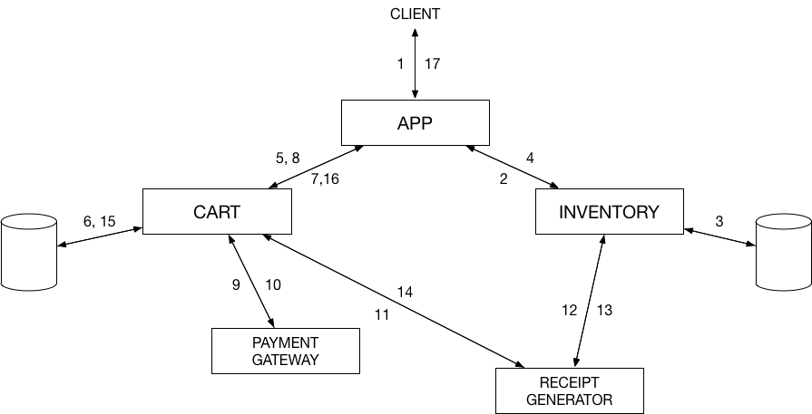

# DisorderlyLabs-Microservice-Infrastructure
In-house MicroService Infrastructure for Disorderly Labs

## Architecture

## Prerequisites 
1. JDK 6+
2. Gradle
3. Docker

## Build the images
Go to individual folders and execute `./gradlew build docker`. You can configure the name of your docker image in the `build.gradle` of each microservice. 

To build all run `sh build.sh`.

## Create Network
`docker network create --subnet=10.0.0.0/16 mynet`

## Setting up the config server
The config server picks up all the configurations from a directory. The location of this directory is given under `spring.cloud.config.server.git.uri` in `src/main/resources/application.properties` file. Follow the steps given below for setup:

1. The folder should be a Git-based filesystem repository. For this project the path is set as `/config`. Do note, this path is that within the container.
2. First create a config folder with path as `${HOME}/config` on your local machine. Make sure you initialize git (`git init`) in that folder
3. Copy the `application.yml` file present under 'files' from this Github repository into config. Once copied, do a `git commit`.   
4. While running the config service (as seen in `start.sh`) specify `-v` parameter as follows: `-v ~/config/:/config`. This mounts the folder at `~/config` on your machine to `/config` on the Docker container.   

## Start the services
`sh start.sh`

You can also run each container separately without the `-d` parameter, to view the logs for each Microservice. 

## Run a sample command
`curl -X PUT "http://localhost:7000/app/instantPlaceOrder?name=Chamber&quantity=7"`

The above call involves all five microservices. First _'App'_ makes a call to _'Inventory'_, to take the item out of inventory (Inventory Database). Then _'App'_ makes a call to _'Cart'_, to add the item to the Cart (Cart Database). Once successful, _'Cart'_ makes a call to _'paymentGateway'_ to process the payment. On successful payment, _'Cart'_ makes a call to _'Invoice'_ to generate invoice.         

